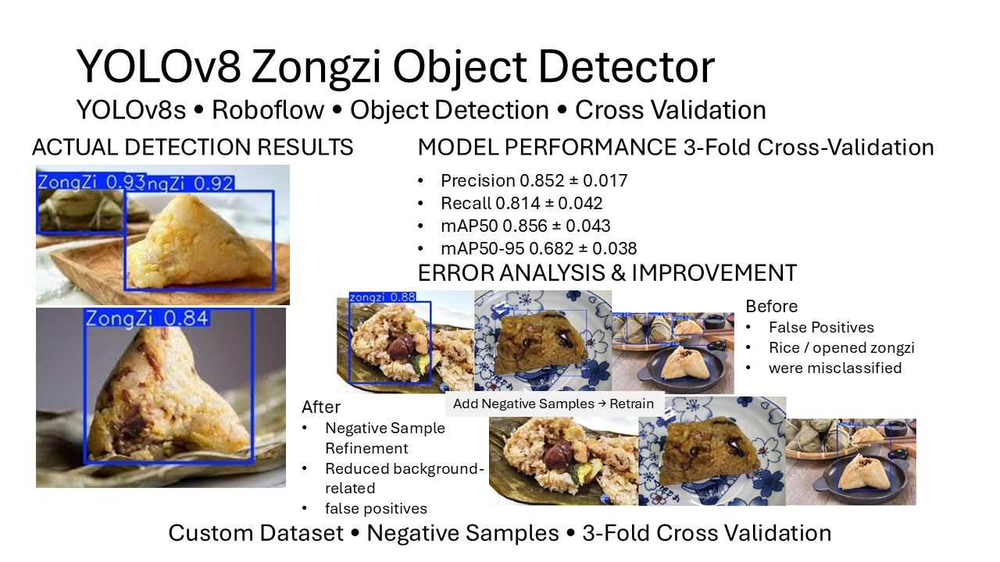
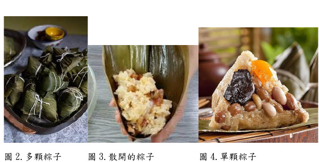
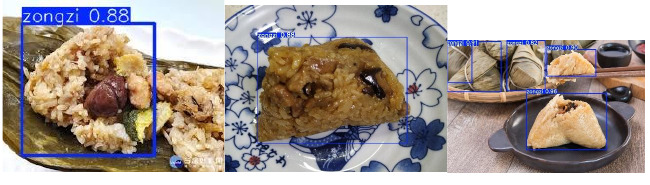
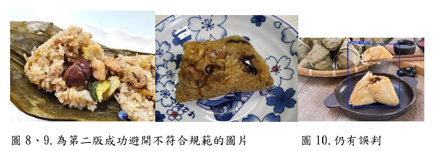
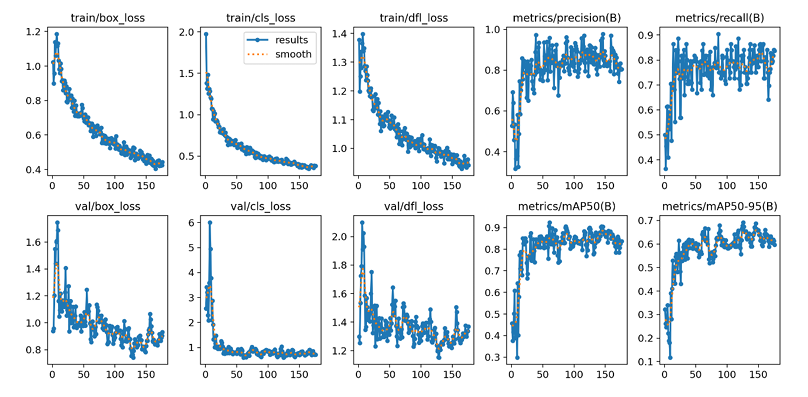
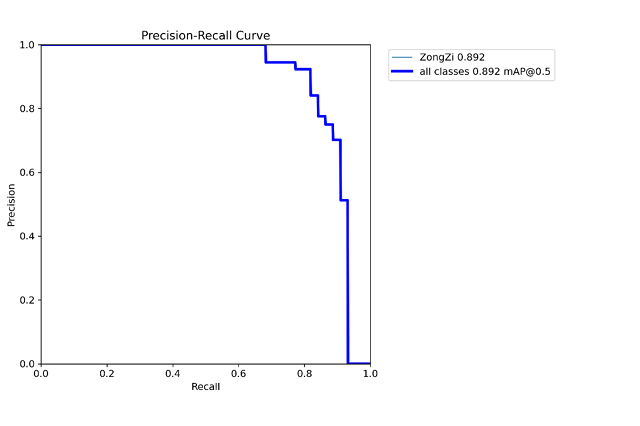
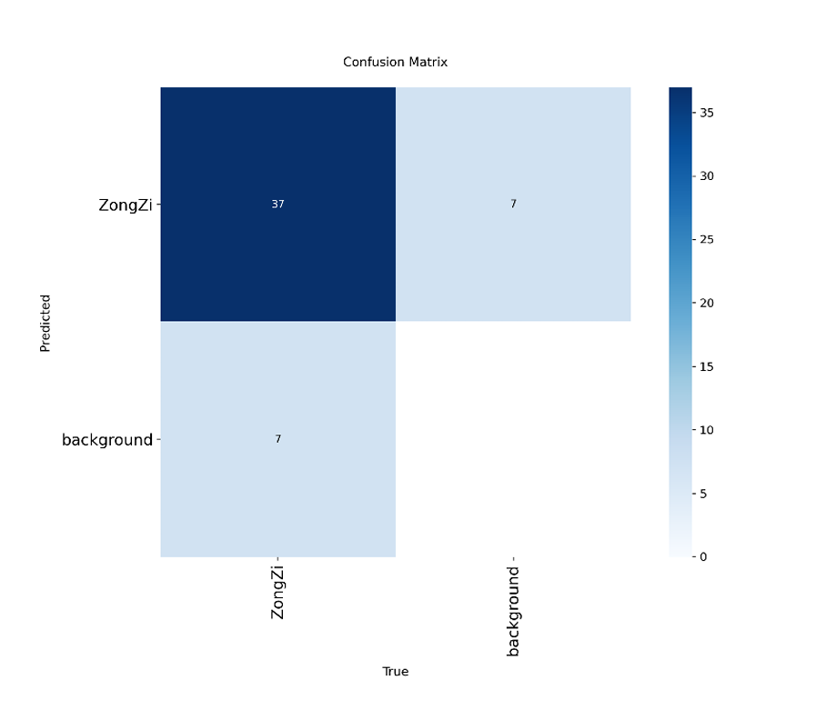
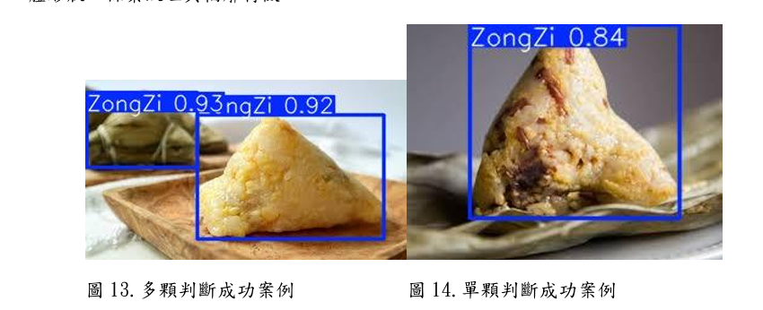

# YOLOv8 Zongzi Object Detector

A YOLOv8s object detection project for detecting complete zongzi, featuring custom dataset annotation, negative-sample refinement, error analysis, and 3-fold cross-validation.



## Project Highlights

- Built a custom single-class object detection dataset for **zongzi**
- Annotated images with bounding boxes using **Roboflow**
- Trained a **YOLOv8s** object detector
- Identified false-positive patterns through external test images
- Added **negative samples** to improve rejection of non-target objects
- Evaluated model stability using **3-fold cross-validation**
- Analyzed the trade-off between **precision and recall**
- Examined successful detections, missed detections, and false detections

### 3-Fold Cross-Validation Results

| Metric | Mean ± Std |
| --- | ---: |
| Precision | **0.852 ± 0.017** |
| Recall | **0.814 ± 0.042** |
| mAP50 | **0.856 ± 0.043** |
| mAP50-95 | **0.682 ± 0.038** |

The results show that the model maintained relatively stable detection performance across different dataset splits.

---

## Problem Definition

The goal of this project is to detect **complete zongzi** in images.

The target definition is intentionally stricter than simply recognizing food that visually resembles zongzi.

Examples such as:

- opened zongzi
- scattered sticky rice
- unfolded zongzi leaves

are treated as **non-target objects**.

This distinction became an important part of the project because visually similar food regions could easily produce false-positive detections.

---

## Dataset & Annotation

Images were annotated using **Roboflow** with bounding boxes in YOLO format.

The detection task contains one class:

```text
zongzi
```

Example dataset content:



### Training Configuration

| Item | Setting |
| --- | --- |
| Model | YOLOv8s |
| Task | Object Detection |
| Class | zongzi |
| Input Size | 640 × 640 |
| Batch Size | 8 |
| Dataset Format | YOLOv8 |
| Annotation | Bounding Box |
| Training Device | NVIDIA GeForce RTX 3060 Ti |

---

## Error Analysis & Negative Sample Refinement

One of the most important findings in this project was that good performance on ordinary zongzi images did not guarantee correct behavior on visually similar non-target objects.

The initial model sometimes classified:

- opened zongzi
- scattered sticky rice
- unfolded leaves

as complete zongzi.

### Before — False Positives



The model had learned visual characteristics such as color, texture, and food appearance, but had not learned strongly enough that these visually similar regions should be treated as background.

### Negative Sample Strategy

To address this issue, additional **negative samples** were added to the training dataset.

These images contained non-target objects such as opened zongzi and scattered rice, but **no zongzi bounding boxes were assigned**.

The purpose was to explicitly teach the model:

```text
Visually Similar Object ≠ Detection Target
```

The model was then retrained using the refined dataset.

### After — Reduced False Positives



After adding negative samples, the model became more conservative when encountering non-target food regions and reduced several background-related false-positive detections.

However, this also introduced a trade-off: a more conservative detector can reduce false positives while increasing the possibility of missing difficult positive samples.

This became one of the main observations of the project.

---

## Training Performance

The training curves show the behavior of the loss functions and evaluation metrics throughout training.



The overall training process showed:

- decreasing box loss
- decreasing classification loss
- decreasing DFL loss
- relatively stable precision
- recall remaining around the 0.8 range
- stable validation mAP after convergence

These results indicate that the model successfully learned the visual characteristics of complete zongzi while still leaving room for improvement on difficult samples.

---

## Precision–Recall Analysis



The Precision–Recall curve illustrates the trade-off between detecting more zongzi and avoiding false-positive predictions.

Because this project uses a strict target definition, confidence threshold selection is important.

A lower threshold can improve recall but may introduce more false positives, while a higher threshold can reduce false positives at the cost of missed detections.

---

## Confusion Matrix



The confusion matrix was used to examine how often zongzi objects were correctly detected and how often foreground/background errors occurred.

Because this is a single-class detection problem, the main errors of interest are:

- zongzi detected as background → missed detection
- background detected as zongzi → false positive

The negative-sample refinement was mainly designed to reduce the second type of error.

---

## 3-Fold Cross-Validation

To reduce the effect of a single train/validation split, the dataset was reorganized into three folds.

For each fold:

- one subset was used as the validation set
- the remaining subsets were used for training
- positive and negative samples were considered during dataset splitting

### Results

| Fold | Best Epoch | Precision | Recall | mAP50 | mAP50-95 |
| --- | ---: | ---: | ---: | ---: | ---: |
| Fold 1 | 52 | 0.8468 | 0.8128 | 0.8654 | 0.6982 |
| Fold 2 | 38 | 0.8709 | 0.8565 | 0.8934 | 0.7101 |
| Fold 3 | 88 | 0.8384 | 0.7727 | 0.8086 | 0.6386 |
| **Average** | — | **0.8520** | **0.8140** | **0.8558** | **0.6823** |
| **Std** | — | **0.0169** | **0.0419** | **0.0432** | **0.0383** |

The average mAP50 of approximately **0.856** suggests that the detector maintained similar performance across multiple dataset partitions instead of depending entirely on one validation split.

Fold 3 produced weaker results than the other folds, indicating that dataset composition, object scale, viewing angle, background complexity, and visually similar negative samples can noticeably affect model performance.

---

## Detection Results

The trained model successfully detects both single and multiple complete zongzi.



The bounding boxes generally align with the detected objects, and high-confidence predictions can be observed in clear examples.

---

## Failure Cases

The model still has limitations.


Observed failure cases include:

### Missed Detections

Some complete zongzi may not be detected when:

- the object is partially occluded
- the object occupies a small region of the image
- the viewing angle is unusual
- the background is visually complex
- the object appearance differs significantly from common training samples

### False Detections

Opened zongzi or visually similar food regions may still occasionally resemble the target strongly enough to produce a detection.

These cases show that additional difficult examples and more diverse negative samples could further improve generalization.

---

## Key Technical Takeaways

The most important lesson from this project was that object detection performance depends on more than model architecture.

The quality and definition of the dataset strongly affected model behavior.

The project progressed from:

```text
Train a YOLOv8 Model
        ↓
Test on Unseen Images
        ↓
Identify False Positives
        ↓
Analyze Dataset Weakness
        ↓
Add Negative Samples
        ↓
Retrain
        ↓
Evaluate Precision / Recall Trade-off
        ↓
3-Fold Cross-Validation
```

The largest improvement in my understanding came from analyzing **why the model made mistakes** instead of only focusing on whether training completed successfully.

---

## What I Learned

Through this project, I gained practical experience with:

- Object detection dataset preparation
- Bounding-box annotation
- Roboflow dataset management
- YOLOv8s model training
- Validation metric interpretation
- Precision and recall trade-offs
- mAP50 and mAP50-95 evaluation
- Negative-sample design
- False-positive and false-negative analysis
- Cross-validation for model stability
- Dataset-driven model improvement

This project helped me understand that improving an object detection system requires an iterative process of **training, testing, error analysis, dataset refinement, and re-evaluation**, rather than simply changing the model architecture.
